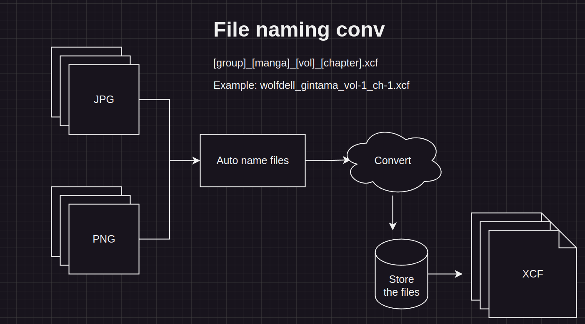

# PNG or JPG to XCF auto formater

Tool for auto formating files from PNG/JPG to XCF. 

This tool automates the task of file naming and saving by just executing a single command. **Make sure that you run the script in the folder, where are all the jpg or png files for formating.**



---

### Instalation:

#### Follow the instructions to install properly

* Step 1: Download the newest release
* Step 2: Make the installer executable ```chmod +x installer.sh```
* Step 3: Run the installer using administrative privileges ```sudo ./installer.sh```
* Step 4: Run the program from anywhere you want ```~$ pjtxcf -[args]```

---

If there are any issues, contact the developer `wolfdell@proton.me` or try using super user privileges.
